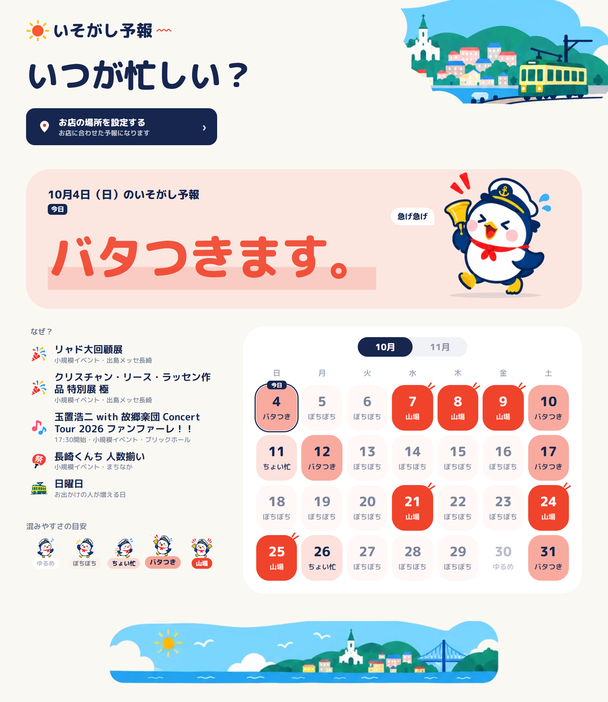

# いそがし予報

シフトを作る前に、街の“いそがしさ”がわかる。

長崎市内の飲食店・小売店で**シフトを作る人**のためのWebアプリです。クルーズ船の入港、イベント、お祭りの公式の予定から、日ごとの忙しさを5段階で予報します。

- 公開中：https://isogashi-yoho-xj5k.vercel.app （登録・ログイン不要）
- 長崎の地域課題をテーマにしたハッカソンで制作（2026年10月）



## 課題と解決

長崎では、クルーズ船の入港、スタジアムシティの試合やライブ、長崎くんちなどで、特定の日に人が集中します。しかし、その情報は会場ごとの公式サイトや港の予定表に別々に載っていて、シフトを作る1週間〜1か月前の時点で「その日がどれくらい忙しくなりそうか」をひと目で知る手段がありません。

いそがし予報は、これらの公式の予定を1か所に集め、天気予報のようにカレンダーで見せます。

## できること

- **カレンダー**：今日から来月末までの忙しさを、5段階（ゆるめ／ぼちぼち／ちょい忙／バタつき／山場）で表示
- **なぜ？**：その日のイベント名・開始時刻・会場、クルーズ船の大きさ・入港時刻など、確かめられる事実を表示
- **お店ごとの設定**：地域を選ぶとおすすめが入り、場所ごとに影響を「大きい／少し／ない」から選択。細かい設定ではバー（0〜100%）と土日祝の影響も調整できる。設定は端末のブラウザにだけ保存

点数やパーセントは画面に出しません。配点の根拠がまだ弱いため、5段階の言葉と事実だけを見せる方針です。

## しくみ

### 忙しさの決め方（`lib/calculateBusyRate.ts`）

ルールベースの足し算です。AIや人流データは使っていません。

```
点数 = 20（基本）＋ イベント ＋ クルーズ船 ＋ 土日祝（+10）
```

| 要素 | めやす | 点 |
|---|---|---|
| イベント・お祭り | 大型：1日1万人以上／中規模：3千人以上／小規模：それ未満・不明 | +55／+25／+10 |
| クルーズ船 | 大型船：10万トン以上／中型船：3万トン以上／小型船 | +20／+10／+5 |
| 土日・祝日 | | +10 |

イベントと船の点には、お店の設定（場所ごとの割合）を掛けます。合計を 30／50／70／85 で5段階に分けます。配点と境目は仮置きで、今後、実際の忙しさと照らして調整します。

### データの集め方（`scripts/`）

すべて公式サイトから、毎朝6時に GitHub Actions で自動取得します。イベントの手入力はありません。

| データ | 出どころ | 方法 |
|---|---|---|
| クルーズ船 | 長崎港の入港予定表（PDF） | プログラムで読み取り（`scripts/import-data.mjs`） |
| 祝日 | 内閣府の祝日一覧（CSV） | 同上 |
| 長崎スタジアムシティ | 公式のイベント一覧 | 同上 |
| 出島メッセ長崎、ブリックホール | 各会場の公式ページ | Gemini が読み取り → プログラムで点検（`scripts/research-events.mjs`） |
| まちなかのお祭り | 長崎市公式観光サイトのイベント一覧 | 同上 |
| Lovefes、長崎ベイサイドマラソン、NAGASAKI CITY JAZZ | それぞれの公式ページ | 同上（今年の開催日だけを読む） |

AI（Gemini）の役割は、公式ページの文章からイベント名・日付・開始時刻を抜き出すことだけです。読み取った結果は、次の点検を通ったものだけをアプリに載せます。

- イベント名が、公式ページの文章にそのまま書かれているか（作り話を防ぐ）
- 日付が正しい形で、今月〜来月の範囲にあるか。14日を超える長期開催ではないか
- 大勢が集まる催しか（小さなセミナー・研修・学校の発表会は載せない）
- 来場者数は AI に決めさせず、会場の収容人数や主催者の発表など、出どころを言える数字を登録して使う

取得に失敗したときは前回の内容を残し、GitHub から通知が届きます。

### 構成

- 画面：Next.js（App Router、静的書き出し）、React、TypeScript、Tailwind CSS
- 計算：利用者のブラウザ内で実行。自前のサーバー・データベースはなし
- データ：JSON ファイル（`data/`）として画面と一緒に配信
- 自動更新：GitHub Actions（`.github/workflows/update-data.yml`）→ Vercel が自動で再公開
- AI：Gemini API（データ収集時のみ。公開サイトには API キーを含まない）

## 動かし方

```bash
npm install
npm run dev
```

http://localhost:3000 で開けます。

| コマンド | 内容 |
|---|---|
| `npm run build` | 公開用のファイルを `out/` に書き出す |
| `npm run lint` | コードの検査 |
| `npm run import-data` | クルーズ船・祝日・スタジアムシティを取り込み直す |
| `npm run research-events` | 公式ページを Gemini に読み取らせ、点検を通ったものを反映する（`.env.local` に `GEMINI_API_KEY=` が必要） |

## ファイル構成

| パス | 役割 |
|---|---|
| `app/page.tsx` | 画面全体（予報、カレンダー、なぜ？、お店の設定） |
| `lib/calculateBusyRate.ts` | 計算のルール、5段階、お店の設定の掛け算 |
| `data/index.ts` | データの入り口。場所の定義、地域ごとのおすすめ設定 |
| `data/imported.json` | プログラムで取り込んだデータ（クルーズ船、祝日、スタジアムシティ） |
| `data/auto-events.json` | AI が読み取り、点検を通ったイベント |
| `data/event-candidates.json` | AI が読み取ったもの全部と、載せなかった理由 |
| `scripts/import-data.mjs` | 取り込みのプログラム |
| `scripts/research-events.mjs` | AI に読み取らせ、点検して反映するプログラム |
| `SPEC.md` | 仕様書 |

## まだできていないこと

- 予報が実際の忙しさと合っているかの検証（配点は仮置き）
- 読み取るページに載っていない催し（商店街の催事など）の取り込み
- 来場者数は会場の収容人数などを使っており、実際に来た人数ではない
- 「公演かセミナーか」の判定は AI 任せで、点検できていない
- お店の中での設定の共有（いまは端末ごと）
- 各サイトの利用規約・robots.txt の確認

## データの出どころについて

載せているのは、公開されている公式サイトの日程・会場名などの事実の情報です。1日1回の取得で、各サイトへの負荷はごく小さくしています。本格的な運用の前に、各サイトの利用の決まりを確認します。
